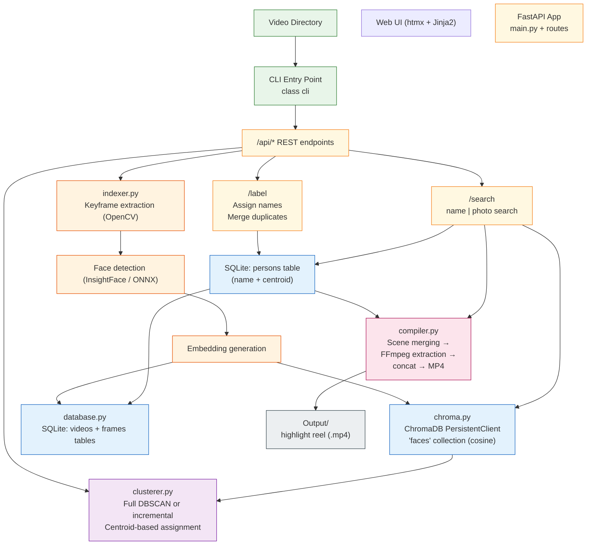

# Multimedia Library Search

Search your local video library by face. Point it at a directory of videos, index them, and find every clip a person appears in — entirely offline, no cloud.

## Requirements

- Python 3.11+
- [FFmpeg](https://ffmpeg.org/download.html) available on `PATH`
- (Optional) NVIDIA GPU + CUDA for faster indexing

## Setup

```bash
git clone <repo>
cd multimedia-library-search

python -m venv .venv
source .venv/bin/activate        # Windows: .venv\Scripts\activate

pip install -r requirements.txt
```

> **GPU users:** replace `onnxruntime` with `onnxruntime-gpu` in `requirements.txt` before running `pip install`.

## Workflow

```
index → (auto-cluster) → label → search → compile
```

1. `python cli.py index /path/to/videos` — extract faces; incremental cluster runs automatically
2. Open `/label` — assign names to person clusters; merge duplicates; re-cluster if needed
3. Open `/search` — search by name or upload a reference photo to find appearances
4. Use the **Highlight Reel** panel on the search page to compile clips into a downloadable MP4

For the first run with no existing clusters, the auto-triggered incremental pass falls back to a full cluster automatically.

### Pipeline



---

## CLI Reference

### Index a video directory

```bash
python cli.py index /path/to/videos
```

| Flag | Default | Description |
|---|---|---|
| `--interval 2.0` | `1.0` | Seconds between sampled keyframes. Higher = faster, lower accuracy. |
| `--gpu` | off | Use CUDA for face inference (requires `onnxruntime-gpu`). |
| `--no-cluster` | off | Skip the automatic incremental cluster pass after indexing. |
| `--eps 0.6` | `0.6` | DBSCAN eps used by the auto-triggered incremental cluster. |

After indexing, stale videos (deleted from disk since the last run) are pruned automatically, then an incremental cluster pass runs so new faces appear in `/label` without a separate step. Pass `--no-cluster` when batch-indexing several directories before a single cluster run.

### Cluster faces into person identities

```bash
python cli.py cluster              # full DBSCAN — initial setup or restructure
python cli.py cluster --incremental  # assign new faces only, preserve labels
```

**Full cluster** groups all faces from scratch using DBSCAN. Use this on first run or to tune `eps` and restructure everything. **All existing labels are lost.**

**Incremental cluster** assigns only unlabeled (new) faces to existing persons using centroid distance, then runs a mini-DBSCAN on the remainder to discover new persons. Existing labels are fully preserved.

After every cluster run, redundant face thumbnails are trimmed automatically — keeping only the representative samples shown in the label UI (at most 5 per person).

| Flag | Default | Description |
|---|---|---|
| `--incremental` | off | Run incremental mode instead of full DBSCAN. |
| `--eps 0.6` | `0.6` | Grouping radius (euclidean distance on L2-normed embeddings). Lower = tighter clusters. |
| `--min-samples 3` | `3` | Minimum faces required to form a cluster. |

### Maintenance commands

```bash
python cli.py prune                   # remove stale data for videos deleted from disk
python cli.py prune --dry-run         # preview what would be removed

python cli.py trim-thumbnails         # delete redundant face thumbnails (keeps label-page samples)
python cli.py trim-thumbnails --dry-run

python cli.py backfill-dates          # populate recorded_at for already-indexed videos
python cli.py stats                   # video count, face count, labeled/unlabeled persons
```

`prune` and `trim-thumbnails` run automatically as part of `index` and `cluster` respectively; these manual commands are for one-off use or verification with `--dry-run`.

`backfill-dates` is a one-time migration for videos indexed before recording-date extraction was added. For each video it tries, in order: ffprobe container tag → filename date pattern → file mtime.

### Start the web UI

```bash
python cli.py serve
```

Opens at `http://127.0.0.1:8000`. Options: `--host 0.0.0.0 --port 8000`.

---

## Web UI

| Page | URL | Description |
|---|---|---|
| Index | `/` | Start indexing, watch live progress, see all indexed videos |
| Label | `/label` | Assign names to person clusters; merge duplicates; trigger re-clustering |
| Search | `/search` | Search by name or reference photo; play results in-browser; compile highlight reels |

### Label page

- **Cluster Unlabeled Faces** — incremental pass; labels preserved, safe to run any time
- **Full Re-cluster** — restructures from scratch; existing labels are erased
- Both controls accept `eps` and `min-samples` with inline tooltips
- Select two cards and click **Merge Selected** to combine duplicate clusters

### Search page

**Search by name** — type a labeled person's name (autocomplete from existing labels). Results are grouped by video, sorted by most appearances first. Each card shows three evenly-sampled scene frames, a scene count, and scene chips.

**Search by photo** — upload any image containing a face. Results are sorted by match confidence (closest embedding distance first) and grouped by video the same way.

**Scene chips** — each chip represents one detected scene. A brief isolated appearance shows as a single timestamp (`1:23`); a continuous stretch shows as a range (`0:00–5:52`). Clicking any chip opens the video at that moment.

**Video player** — custom player with:
- Timestamp markers on the scrubber (yellow lines at every detected appearance)
- Hover a marker to see the time; click to jump to it
- `Space` — play / pause
- `←` / `→` — seek ±5 seconds
- `Esc` — close
- Fullscreen button

### Highlight Reel

Appears on the search page whenever named persons are in the results. Compiles all appearances for a person into a single downloadable MP4 using FFmpeg.

| Setting | Default | Description |
|---|---|---|
| Clip length (sec) | 30 | Duration of each snippet, centered on the detected scene midpoint. |
| Scene gap (sec) | 30 | Detections within this many seconds are treated as one scene → one clip. |
| Max clips per video | 5 | Cap on scenes taken from a single video, so one long video doesn't dominate. |
| Clip order | Earliest first | Order clips by recording date ascending, descending, or randomly. |

Recording date comes from the ffprobe container tag, filename date pattern, or file mtime — in that priority order. Run `python cli.py backfill-dates` to populate dates for already-indexed videos.

---

## API

| Method | Path | Description |
|---|---|---|
| `POST` | `/api/index` | Start indexing a directory (`directory_path`, `interval_sec`) |
| `GET` | `/api/index/status` | Indexing progress |
| `POST` | `/api/cluster` | Start a cluster job (`incremental`, `eps`, `min_samples`) |
| `GET` | `/api/cluster/status` | Cluster job progress |
| `GET` | `/api/persons` | List all person clusters (id, name, thumbnail, face_count) |
| `POST` | `/api/persons/{id}/label` | Save a name for a person |
| `POST` | `/api/persons/merge` | Merge two clusters (`source_id`, `target_id`) |
| `GET` | `/api/search?name=Alice` | Find all appearances of a named person |
| `POST` | `/api/search/photo` | Upload a face photo; returns ranked matches |
| `GET` | `/api/video/{id}` | Stream a video file with HTTP range request support |
| `GET` | `/api/frame/{id}?t=47` | Extract a single JPEG frame at the given timestamp (cached) |
| `POST` | `/api/compile` | Start a highlight reel job (`person_id`, `clip_duration_sec`, `merge_gap_sec`, `max_clips_per_video`, `order`) |
| `GET` | `/api/compile/{job_id}` | Poll reel job status and progress |
| `GET` | `/api/compile/{job_id}/download` | Download the finished MP4 |

---

## Project structure

```
multimedia-library-search/
├── requirements.txt
├── cli.py                   # CLI entry point
├── app/
│   ├── config.py            # Paths and constants
│   ├── database.py          # SQLite (videos, persons tables)
│   ├── chroma.py            # ChromaDB face embeddings store
│   ├── indexer.py           # Frame extraction + InsightFace pipeline
│   ├── clusterer.py         # Full DBSCAN + incremental clusterer
│   ├── compiler.py          # Scene merging + FFmpeg highlight reel
│   └── api/
│       ├── index.py         # /api/index
│       ├── cluster.py       # /api/cluster
│       ├── persons.py       # /api/persons
│       ├── search.py        # /api/search, /api/search/photo
│       ├── video.py         # /api/video, /api/frame
│       └── compile.py       # /api/compile
└── templates/
    ├── base.html            # Nav + shared layout
    ├── index.html           # Indexing page
    ├── label.html           # Labeling + clustering page
    └── search.html          # Search page with custom video player
```

Generated at runtime (gitignored):

```
data/                # SQLite DB + ChromaDB files
static/thumbnails/   # Face crop PNGs
output/              # Compiled highlight reels
```

## Data

All indexed data lives in `data/` and `static/thumbnails/`. Delete those directories to start over.

## Roadmap

- [x] Phase 1 — Indexing pipeline + CLI
- [x] Phase 2 — Face clustering + labeling UI
- [x] Phase 2.5 — Progressive incremental clustering
- [x] Phase 3 — Search by name or reference photo + in-browser playback
- [x] Phase 4 — Highlight reel compilation (FFmpeg clip extraction + concat)
